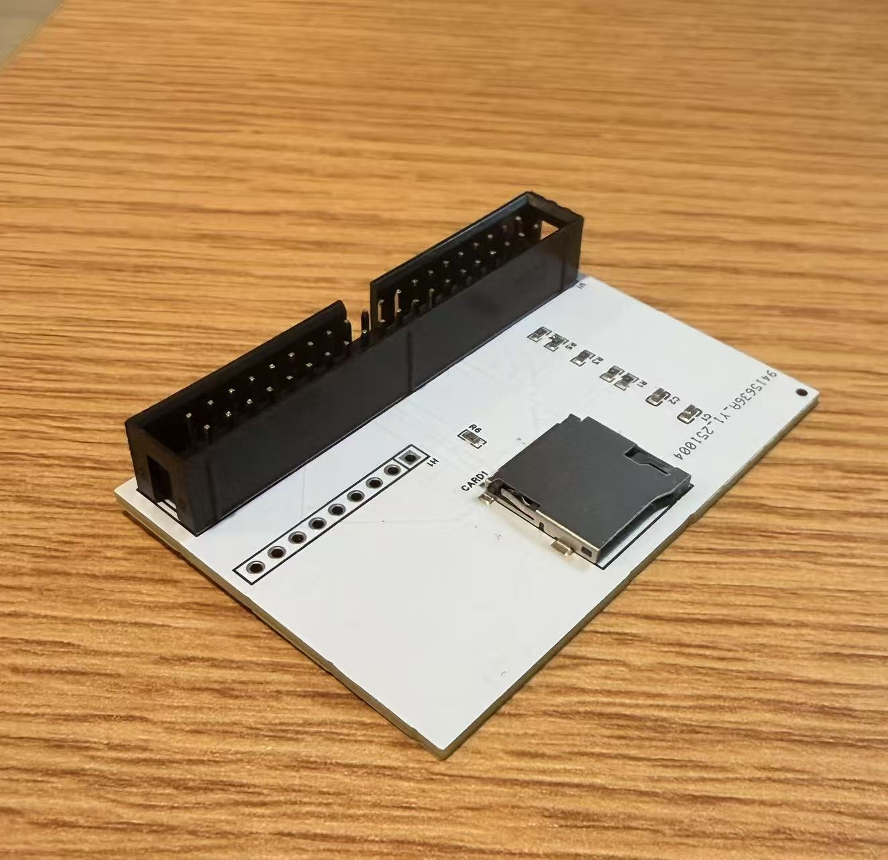
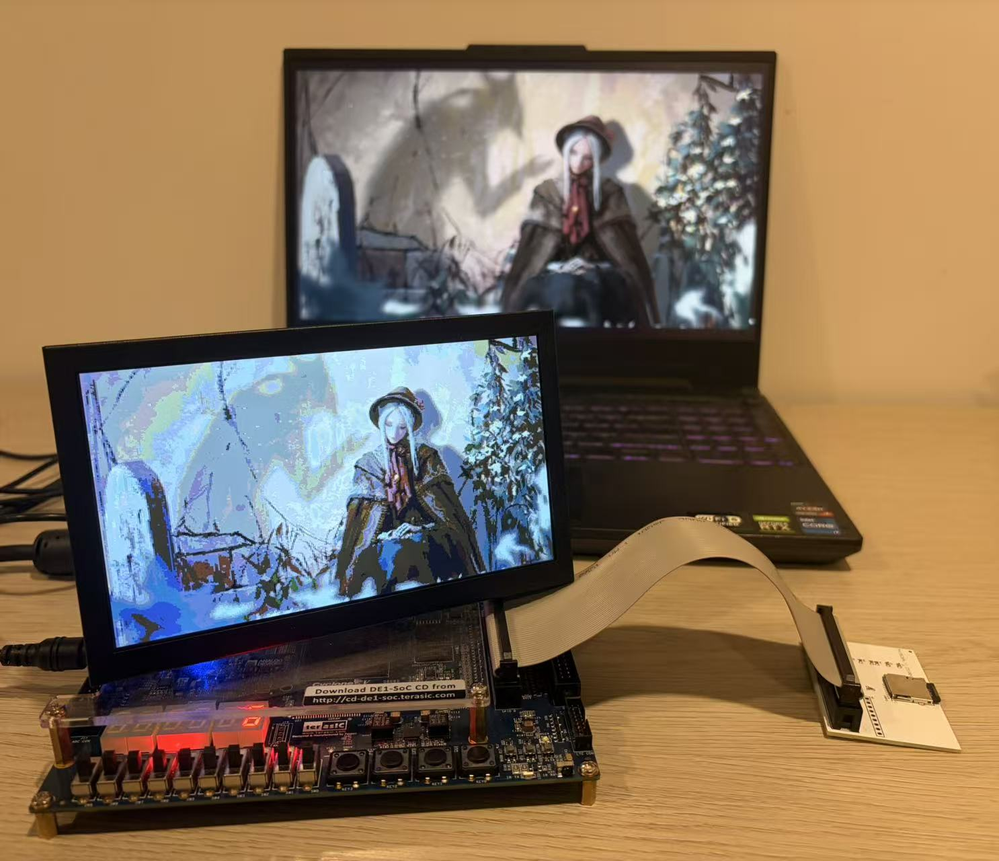

<a id="en"></a>

# DE1-SoC TF Card Reader and VGA Display


[English](#en) | [中文](#cn)

## 1. Overview

This project targets the DE1-SoC board and uses FPGA logic to access a TF card in SD Native 1-bit mode. It parses a FAT32 file system, locates `IMAGE.BIN`, stores a 320x240 RGB332 image into on-chip RAM, and displays it through VGA at 640x480@60Hz using 2x pixel scaling.

The DE1-SoC on-board TF card slot is wired directly to the HPS and does not expose an FPGA interface. Because of that, this project uses a custom TF breakout board that reroutes the TF card signals to the FPGA-accessible 40-pin GPIO header.

Main data path:

`TF Card -> sdcmd_ctrl -> sd_reader -> sd_file_reader -> img_ram -> vga_ctrl -> VGA`

This repository includes:

- Synthesizable RTL
- Quartus pin constraints
- Layered UVM verification environment
- RGB332 image generation and preview utilities
- TF card breakout board PCB design files (Schematic, Gerber, BOM)

## 2. Features

- SD native initialization sequence: CMD0, CMD8, CMD55, ACMD41, CMD2, CMD3, CMD7, CMD16
- CMD17 single-block read with DAT0 data capture
- FAT32 parsing: MBR, boot sector, root directory, and file data
- Automatic search for `IMAGE.BIN`
- VGA output after buffering image data in RAM
- Python tools for generating and previewing RGB332 test images
- Layered UVM verification environment from Layer1 to Layer3

## 3. Hardware Result

The design has been validated on real hardware. After correcting the TF card DAT pin mapping, the system can display the full `IMAGE.BIN` image successfully.

Current debug indicators:

- `HEX0 = 6`: file reader state machine reached `DONE`
- `LEDR0 = 1`: `IMAGE.BIN` found
- `LEDR1 = 1`: image read completed

`LEDR6` is currently a latched historical timeout indicator, so it may remain on even when the final display is successful.

## 4. Required Materials

- DE1-SoC fpga board
- TF or Micro SD card
- TF card breakout board or custom adapter
- VGA monitor and VGA cable
- USB-Blaster programming cable
- Windows host PC
- Intel Quartus Prime Lite 18.1
- QuestaSim
- Python 3
<div align="center">
  
  <br>
  <i style="color: #666;">TF card breakout board</i>
</div>

## 5. Repository Structure

- [RTL/top_sd_vga.sv](RTL/top_sd_vga.sv): top-level integration
- [RTL/sdcmd_ctrl.sv](RTL/sdcmd_ctrl.sv): SD command and response controller
- [RTL/sd_reader.sv](RTL/sd_reader.sv): SD initialization and sector reader
- [RTL/sd_file_reader.sv](RTL/sd_file_reader.sv): FAT32 parsing and file reader
- [RTL/img_ram.sv](RTL/img_ram.sv): image RAM
- [RTL/vga_ctrl.sv](RTL/vga_ctrl.sv): VGA timing controller
- [breakout_board_pcb](breakout_board_pcb): breakout board deliverables, including schematic, BOM, and Gerber package
- [image generation](image%20generation): image conversion utilities and usage notes
- [pin_assign.tcl](pin_assign.tcl): pin assignment reference script
- [uvm_tb](uvm_tb): UVM verification environment
- [generate_image_bin.py](generate_image_bin.py): generate RGB332 image files
- [view_image_bin.py](view_image_bin.py): preview RGB332 image files

## 6. Pin Mapping

The following TF card mapping is the currently verified working configuration:

| Signal | JP1 Pin | GPIO_0 | FPGA Pin |
| --- | --- | --- | --- |
| SD_CLK | 20 | GPIO_0_D17 | PIN_AA19 |
| SD_CMD | 18 | GPIO_0_D15 | PIN_AG17 |
| SD_DAT3 | 16 | GPIO_0_D13 | PIN_AE16 |
| SD_DAT2 | 14 | GPIO_0_D11 | PIN_AH17 |
| SD_DAT1 | 24 | GPIO_0_D21 | PIN_AJ20 |
| SD_DAT0 | 22 | GPIO_0_D19 | PIN_AC20 |
| SD_CD | 26 | GPIO_0_D23 | PIN_AK21 |

## 7. IMAGE.BIN Format

- The file name must be `IMAGE.BIN`
- Default resolution is 320x240
- Pixel format is RGB332
- Total size is `320 x 240 = 76800` bytes
- The file must be stored in a FAT32 file system so the design can locate it automatically

## 8. Generate and Preview Images

Generate test images:

```bash
python generate_image_bin.py -o IMAGE.BIN -p gradient
python generate_image_bin.py -o IMAGE.BIN -p checker -b 8
python generate_image_bin.py -o IMAGE.BIN -p stripes -b 16
python generate_image_bin.py -o IMAGE.BIN -p ramp
```

Preview images:

```bash
python view_image_bin.py IMAGE.BIN
python view_image_bin.py IMAGE.BIN --ascii
python view_image_bin.py IMAGE.BIN -o preview.ppm
```

## 9. Hardware Deployment

1. Run the image generation program in [generate_image_bin.py](generate_image_bin.py) to create an `IMAGE.BIN` file.
2. Copy the generated `IMAGE.BIN` file to a TF card formatted as FAT32.
3. Create a new Quartus project.
4. Run the pin assignment Tcl script [quartus/pin_assign.tcl](quartus/pin_assign.tcl).
5. Add all source files under [RTL](RTL) to the Quartus project.
6. Select `top_sd_vga` as the top-level entity.
7. Compile the project and program the bitstream to the board.
8. Use a 40-pin ribbon cable to connect the DE1-SoC GPIO header to the connector on the breakout PCB.
9. Connect the VGA cable and monitor.
10. Insert the prepared TF card into the breakout board.
11. Press `KEY0` to reset the design.
12. The image stored in `IMAGE.BIN` should now appear on the VGA display.


*Image Source: The image displayed is "Bloodborne" by wlop on Patreon*

## Credits & Acknowledgements
- **Architecture Inspiration:** The overall system architecture and data flow of this project were inspired by [FPGA-SDcard-Reader](https://github.com/WangXuan95/FPGA-SDcard-Reader), which is licensed under **GPL-3.0**. While the entire codebase was independently implemented from scratch, the structural design owes much to their pioneering work.
- **Artwork:** Special thanks to [wlop](https://www.patreon.com/wlop) for the *Bloodborne* fan art used in the hardware demo.

<a id="cn"></a>

## 1. 项目简介

本项目基于 DE1-SoC 开发板，使用 FPGA 逻辑直接以 SD Native 1-bit 模式读取 TF 卡，解析 FAT32 文件系统中的 `IMAGE.BIN` 文件，将 320x240、RGB332 格式的图像写入片上 RAM，并通过 VGA 输出为 640x480@60Hz、2 倍放大的图像。

由于 DE1-SoC 板载 TF 卡槽直接连接到 HPS，并没有提供给 FPGA 使用的接口，因此本项目需要自制一个 TF 转接板，将 TF 卡信号转接到 FPGA 可访问的 40Pin GPIO 接口上。

项目主数据路径如下：

`TF Card -> sdcmd_ctrl -> sd_reader -> sd_file_reader -> img_ram -> vga_ctrl -> VGA`

本项目包含：

- 可综合的 RTL 设计
- Quartus 工程与引脚约束
- QuestaSim/UVM 分层验证环境
- RGB332 图像生成与预览脚本
- TF 卡转接板 PCB 设计文件（包含原理图、Gerber 生产文件和 BOM 表）

## 2. 功能特性

- SD 原生模式初始化流程：CMD0, CMD8, CMD55, ACMD41, CMD2, CMD3, CMD7, CMD16
- 单块读命令 CMD17 与 DAT0 数据接收
- FAT32 解析：MBR、Boot Sector、Root Directory、文件数据读取
- 自动查找 `IMAGE.BIN`
- 图像缓存到 RAM 后通过 VGA 显示
- 支持 Python 工具快速生成和预览 RGB332 测试图像
- 提供 Layer1 到 Layer3 的 UVM 验证环境

## 3. 当前硬件结果

项目已经在实际硬件上完成验证，修正 TF 卡 DAT 引脚映射后，可以完整显示 `IMAGE.BIN` 图像。当前调试指示含义如下：

- `HEX0 = 6`：文件读取状态机进入 `DONE`
- `LEDR0 = 1`：找到 `IMAGE.BIN`
- `LEDR1 = 1`：图像读取完成

`LEDR6` 在当前设计中是历史超时锁存灯，即使最终成功显示，也可能保持点亮。

## 4. 所需材料

- DE1-SoC 开发板
- TF 卡或 Micro SD 卡
- TF 卡转接板或自制连接板
- VGA 显示器与 VGA 线缆
- USB-Blaster 下载线
- Intel Quartus Prime Lite 18.1
- QuestaSim
- Python 3
<div align="center">
  
  <br>
  <i style="color: #666;">Tf卡转接板</i>
</div>

## 5. 仓库结构

- [RTL/top_sd_vga.sv](RTL/top_sd_vga.sv): 顶层模块
- [RTL/sdcmd_ctrl.sv](RTL/sdcmd_ctrl.sv): SD CMD 发送与响应接收
- [RTL/sd_reader.sv](RTL/sd_reader.sv): SD 初始化与扇区读取
- [RTL/sd_file_reader.sv](RTL/sd_file_reader.sv): FAT32 解析与文件读取
- [RTL/img_ram.sv](RTL/img_ram.sv): 图像 RAM
- [RTL/vga_ctrl.sv](RTL/vga_ctrl.sv): VGA 时序控制
- [breakout_board_pcb](breakout_board_pcb): TF 转接板工程资料，包含原理图、BOM 和 Gerber 打包文件
- [image generation](image%20generation): 图像转换脚本与使用说明
- [pin_assign.tcl](pin_assign.tcl): 引脚分配参考脚本
- [sim/Makefile](sim/Makefile): 仿真入口
- [generate_image_bin.py](generate_image_bin.py): 生成 RGB332 图像文件
- [view_image_bin.py](view_image_bin.py): 预览 RGB332 图像文件

## 6. 关键引脚映射

当前已经在硬件上验证可工作的 TF 卡映射如下：

| Signal | JP1 Pin | GPIO_0 | FPGA Pin |
| --- | --- | --- | --- |
| SD_CLK | 20 | GPIO_0_D17 | PIN_AA19 |
| SD_CMD | 18 | GPIO_0_D15 | PIN_AG17 |
| SD_DAT3 | 16 | GPIO_0_D13 | PIN_AE16 |
| SD_DAT2 | 14 | GPIO_0_D11 | PIN_AH17 |
| SD_DAT1 | 24 | GPIO_0_D21 | PIN_AJ20 |
| SD_DAT0 | 22 | GPIO_0_D19 | PIN_AC20 |
| SD_CD | 26 | GPIO_0_D23 | PIN_AK21 |


## 7. 图像文件格式

- 文件名必须为 `IMAGE.BIN`
- 分辨率默认为 320x240
- 像素格式为 RGB332
- 总字节数为 `320 x 240 = 76800` 字节
- 文件需放入 FAT32 文件系统中，供设计自动搜索

## 8. 生成与预览图像

生成测试图像：

```bash
python generate_image_bin.py -o IMAGE.BIN -p gradient
python generate_image_bin.py -o IMAGE.BIN -p checker -b 8
python generate_image_bin.py -o IMAGE.BIN -p stripes -b 16
python generate_image_bin.py -o IMAGE.BIN -p ramp
```

预览图像：

```bash
python view_image_bin.py IMAGE.BIN
python view_image_bin.py IMAGE.BIN --ascii
python view_image_bin.py IMAGE.BIN -o preview.ppm
```

更多脚本使用说明和实际照片预留位置见 [image generation/README.md](image%20generation/README.md)。

## 9. 部署方式

1. 运行 [generate_image_bin.py](generate_image_bin.py) 中的图片生成程序，获得 `IMAGE.BIN` 文件。
2. 将生成好的 `IMAGE.BIN` 拷贝到格式化为 FAT32 的 TF 卡中。
3. 在 Quartus 中创建一个新的工程。
4. 运行引脚分配脚本 [quartus/pin_assign.tcl](quartus/pin_assign.tcl)。
5. 将 [RTL](RTL) 文件夹中的所有源文件加入 Quartus 工程。
6. 选择 `top_sd_vga` 作为顶层模块。
7. 运行综合与编译，并将生成的比特流烧录到开发板。
8. 通过 40Pin 口排线连接 DE1-SoC 与 breakout PCB 上的接口。
9. 接好 VGA 显示器和 VGA 线缆。
10. 将准备好的 TF 卡插入转接板。
11. 按下 `KEY0` 进行复位。
12. VGA 显示器上即可看到 `IMAGE.BIN` 对应的图片。


## 致谢与参考
- **架构参考：** 本项目的整体系统架构与数据流参考了 [FPGA-SDcard-Reader](https://github.com/WangXuan95/FPGA-SDcard-Reader)（基于 **GPL-3.0** 协议）。尽管本项目的所有代码均为独立编写实现，但其结构设计很大程度上受益于原作者的开创性工作。
- **艺术致谢：** 感谢画师 [wlop](https://www.patreon.com/wlop) 创作的《Bloodborne》同人画作，本项目将其用于硬件演示。